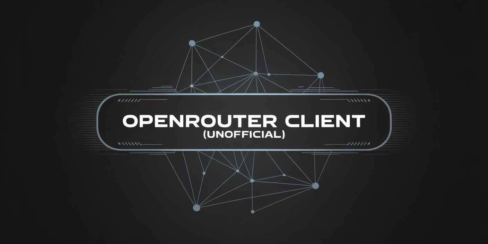

# OpenRouter Python Client (Unofficial)


<br>

An unofficial Python client for [OpenRouter](https://openrouter.ai/), providing a comprehensive interface for interacting with large language models through the OpenRouter API.

## Features

- **Full API Support (Almost)**: Access all major OpenRouter endpoints including chat completions, text completions, model information, generations, credits, and API key management
- **Streaming Support**: Stream responses from chat and completion endpoints
- **Automatic Rate Limiting**: Automatically configures rate limits based on your API key's limits using SmartSurge
- **Smart Retries**: Built-in retry logic with exponential backoff for reliable API communication
- **Opt-in 429 Retry**: Optional retry-with-backoff for `429 Too Many Requests` responses via `RetryConfig`
- **Cost & Usage Tracking**: Per-request cost/usage on `response.usage.cost`; the high-level API exposes `model.last_usage` and `conversation.total_cost`
- **Type Safety**: Fully typed interfaces with Pydantic models for all request and response data
- **Tool Calling**: Built-in support for tool-calling with helper functions and decorators
- **Automatic Tool Loop**: Hand the high-level API a `ToolLoop` and it executes the model's tool calls and feeds the results back until it answers — including alongside JSON-schema structured output
- **Safe Key Management**: Secure API key management with in-memory encryption and extensible secrets management
- **Comprehensive Testing**: Extensive test suite with both local unit tests and remote integration tests

## Disclaimer

This project is independently developed and is not affiliated with, endorsed, or sponsored by OpenRouter, Inc.

Your use of the OpenRouter API through this interface is subject to OpenRouter's Terms of Service, Privacy Policy, and any other relevant agreements provided by OpenRouter, Inc. You are responsible for reviewing and complying with these terms.

This project is an open-source interface designed to interact with the OpenRouter API. It is provided "as-is," without any warranty, express or implied, under the terms of the Apache 2.0 License.

## Installation

Install from a GitHub release tag (there is no PyPI package):

```bash
pip install "git+https://github.com/jmazzahacks/openrouter-python-client@v0.0.21"
```

For development, clone the repo and install in editable mode with dev tooling:

```bash
git clone https://github.com/jmazzahacks/openrouter-python-client.git
cd openrouter-python-client
pip install -e ".[dev]"
```

## Quickstart

```python
from openrouter_client import OpenRouterClient

# Initialize the client
client = OpenRouterClient(
    api_key="your-api-key",  # Or set OPENROUTER_API_KEY environment variable
)

# Chat completion example
response = client.chat.create(
    model="anthropic/claude-3-opus",  # Or any other model on OpenRouter
    messages=[
        {"role": "system", "content": "You are a helpful assistant."},
        {"role": "user", "content": "Tell me about OpenRouter."}
    ]
)

print(response.choices[0].message.content)
```

## Client Configuration

```python
from openrouter_client import OpenRouterClient

client = OpenRouterClient(
    api_key="your-api-key",  # API key for authentication
    provisioning_api_key="your-prov-key",  # Optional: for API key management
    base_url="https://openrouter.ai/api/v1",  # Base URL for API
    organization_id="your-org-id",  # Optional organization ID
    reference_id="your-ref-id",  # Optional reference ID
    timeout=60.0,  # Request timeout in seconds
    retries=3,  # Number of retries for failed requests
    backoff_factor=0.5,  # Exponential backoff factor
    rate_limit=None,  # Optional custom rate limit (auto-configured by default)
)
```

### Automatic Rate Limiting

The client automatically configures rate limits based on your API key's limits during initialization. It fetches your current key information and sets appropriate rate limits to prevent hitting API limits. This happens transparently when you create a new client instance.

If you need custom rate limiting, you can still provide your own configuration via the `rate_limit` parameter.

You can also calculate rate limits based on your remaining credits:

```python
# Calculate rate limits based on available credits
rate_limits = client.calculate_rate_limits()
print(f"Recommended: {rate_limits['requests']} requests per {rate_limits['period']} seconds")
```

### Retrying 429s with Backoff (opt-in)

A `429 Too Many Requests` always surfaces as a `openrouter_client.RateLimitExceeded`
(this is normalized for you — see the note below). By default the client does **not**
silently retry it, so a caller's own retry loop stays in control. If you'd rather have
the client absorb transient rate limits for you, pass a `RetryConfig` (disabled unless
you set `enabled=True`):

```python
from openrouter_client import OpenRouterClient, RetryConfig

client = OpenRouterClient(
    api_key="your-api-key",
    retry_config=RetryConfig(
        enabled=True,
        max_retries=5,           # retries after the initial attempt (total tries = 6)
        base_delay=1.0,          # first backoff is base_delay * factor**0 seconds
        factor=2.0,              # exponential growth per attempt
        max_delay=30.0,          # cap on any single sleep this layer performs
        jitter=0.25,             # up to 0.25s random jitter added per sleep
        respect_retry_after=True # honor a Retry-After value that reaches this layer
    ),
)
```

When enabled, the client retries 429s that surface to it, applying exponential backoff
with jitter between attempts (clamped to `max_delay`). If all retries are exhausted, the
raised `RateLimitExceeded` carries `attempts` and `elapsed_seconds` in its `details` so
you can tell "gave up after N backed-off tries" from an instant 429. Requests with a
one-shot body (`files=`, or a streaming `data=`) are **not** retried, since the body
cannot be safely re-sent.

> **How this interacts with SmartSurge:** the underlying `SmartSurgeClient` already
> handles a 429 that carries a parseable `Retry-After` header itself — it waits the
> server-specified time (uncapped) and retries internally, so those never reach this
> layer. In practice the 429s `RetryConfig` governs are the ones **without** a usable
> `Retry-After`; `respect_retry_after` only applies on the rarer path where a value does
> reach this layer. Note also that each retried attempt still emits SmartSurge's own
> per-exception ERROR log line.

> The separate `retries` / `backoff_factor` client parameters above are SmartSurge's
> transport-level retries for 5xx/connection errors; `RetryConfig` is the 429-specific
> policy and is independent of them.

## Examples

### Catalog alias metadata

`client.models.list(details=True)` preserves each model's optional
`alias_target` object, including its `slug` and `name` when supplied. It is
`None` when absent or null. Consumers can inspect it before creating a
conversation; it describes a catalog alias, not a completion's served model.
`model.architecture.tokenizer` also exposes the catalog's `Router` marker.
The library preserves these fields without imposing a model-selection policy.


### Streaming Responses

```python
from openrouter_client import OpenRouterClient

client = OpenRouterClient(api_key="your-api-key")

# Stream the response
for chunk in client.chat.create(
    model="openai/gpt-4",
    messages=[
        {"role": "user", "content": "Write a short poem about AI."}
    ],
    stream=True,
):
    if chunk.choices and chunk.choices[0].delta.content:
        print(chunk.choices[0].delta.content, end="")
```

### Function Calling

```python
from openrouter_client import OpenRouterClient, tool
from openrouter_client.models import ChatCompletionTool, FunctionDefinition, StringParameter, FunctionParameters

client = OpenRouterClient(api_key="your-api-key")

# Method 1: Using the @tool decorator (recommended)
@tool()
def get_weather(location: str) -> str:
    """Get the weather for a location.
    
    Args:
        location: The city and state
        
    Returns:
        Weather information for the location
    """
    # Your weather API logic here
    return f"The weather in {location} is sunny."

# Method 2: Manual tool definition
weather_tool = ChatCompletionTool(
    type="function",
    function=FunctionDefinition(
        name="get_weather",
        description="Get the weather for a location",
        parameters=FunctionParameters(
            type="object",
            properties={
                "location": StringParameter(
                    type="string",
                    description="The city and state"
                )
            },
            required=["location"]
        )
    )
)

# Make a request with tool
response = client.chat.create(
    model="anthropic/claude-3-opus",
    messages=[
        {"role": "user", "content": "What's the weather like in San Francisco?"}
    ],
    tools=[get_weather.as_chat_completion_tool],  # Using the decorated function
)

# Process tool calls
if response.choices[0].message.tool_calls:
    tool_call = response.choices[0].message.tool_calls[0]
    print(f"Tool called: {tool_call.function.name}")
    print(f"Arguments: {tool_call.function.arguments}")
```

### Automatic Tool Loop

The example above returns the tool call for you to execute yourself. The
high-level llm-style API can run the whole round trip instead: pass a `ToolLoop`
and it executes each tool call, feeds the result back, and repeats until the
model produces an answer.

```python
from openrouter_client import OpenRouterClient, ToolLoop, get_model
from openrouter_client.tools import build_chat_completion_tool

client = OpenRouterClient(api_key="your-api-key")

def get_weather(city: str) -> dict:
    """Get the current weather for a city."""
    return {"city": city, "temp_c": 3, "conditions": "snow"}

loop = ToolLoop(
    tools=[build_chat_completion_tool(get_weather)],
    handlers={"get_weather": get_weather},
    max_rounds=8,          # optional; bounds how many times handlers may run
)

model = get_model("anthropic/claude-haiku-4.5", client)
answer = model.prompt("Should I bring a jacket in Oslo?", tool_loop=loop)

# Works with structured output too - the model uses tools freely, then
# returns an object matching your schema.
report = model.prompt(
    "Summarise the weather in Oslo.",
    schema={"type": "object",
            "properties": {"city": {"type": "string"},
                           "verdict": {"type": "string"}},
            "required": ["city", "verdict"]},
    tool_loop=loop,
)
print(report["verdict"])   # always a dict when schema= is passed
```

Tool failures raise `ToolExecutionError`, and exceeding `max_rounds` raises
`ToolCallLimitExceeded` (both in `openrouter_client.exceptions`). A failed turn
rolls the conversation history back, so catching the error and retrying is safe.

See [LLM_CONVERSATION_API.md](LLM_CONVERSATION_API.md) for conversations,
usage/cost tracking, and the full error contract.

### Prompt Caching

```python
from openrouter_client import OpenRouterClient

client = OpenRouterClient(api_key="your-api-key")

# OpenAI models: automatic caching for prompts > 1024 tokens
response = client.chat.create(
    model="openai/gpt-3.5-turbo",
    messages=[
        {"role": "user", "content": f"Here is a long document: {long_text}\n\nSummarize this document."}
    ]
)

# Anthropic models: explicit cache_control markers
response = client.chat.create(
    model="anthropic/claude-3-opus",
    messages=[
        {
            "role": "user",
            "content": [
                {"type": "text", "text": "Here is a long document:"},
                # Mark this part for caching
                {"type": "text", "text": long_text, "cache_control": {"type": "ephemeral"}},
                {"type": "text", "text": "Summarize this document."}
            ]
        }
    ]
)
```

### Context Length Management

The client provides built-in context length management:

```python
# Refresh model context lengths from the API
context_lengths = client.refresh_context_lengths()

# Get context length for a specific model
max_tokens = client.get_context_length("anthropic/claude-3-opus")
print(f"Claude 3 Opus supports up to {max_tokens} tokens")
```

### API Key Management

Manage API keys programmatically (requires provisioning API key):

```python
client = OpenRouterClient(
    api_key="your-api-key",
    provisioning_api_key="your-provisioning-key"
)

# Get current key information
key_info = client.keys.get_current()
print(f"Current usage: {key_info['data']['usage']} credits")
print(f"Rate limit: {key_info['data']['rate_limit']['requests']} requests per {key_info['data']['rate_limit']['interval']}")

# List all keys
keys = client.keys.list()

# Create a new key
new_key = client.keys.create(
    name="My New Key",
    label="Production API Key",
    limit=1000.0  # Credit limit
)
```

## Model Compatibility & Caveats

OpenRouter routes to hundreds of models from many providers, and they do **not**
behave identically. The items below were checked against live APIs on
**2026-08-30** using `openai/gpt-4o-mini`, `anthropic/claude-fable-5`,
`anthropic/claude-sonnet-5`, `anthropic/claude-opus-5`,
`anthropic/claude-haiku-4.5`, `anthropic/claude-sonnet-4`,
`anthropic/claude-opus-4.1` and `google/gemini-2.5-flash` /
`gemini-3-flash-preview`. Anything not verified is labelled as such — please
don't read an untested row as a guarantee.

### Verified working with the tool loop

Each of these ran the full path end to end: tool loop, tool loop + `schema`
(returning a validated dict), and a tool turn followed by a tool-free follow-up
turn.

| Model | Tool loop | Loop + `schema` | Follow-up turn |
|---|---|---|---|
| `anthropic/claude-fable-5` | pass | pass | pass |
| `anthropic/claude-opus-5` | pass | pass | pass |
| `anthropic/claude-sonnet-5` | pass | pass | pass |
| `anthropic/claude-haiku-4.5` | pass | pass | pass |
| `openai/gpt-4o-mini` | pass | pass | pass |
| `google/gemini-2.5-flash` | pass | not tested | not tested |

Fable 5, Opus 5 and Sonnet 5 are fully supported — including the structured
output path, which is the one that needs the prefill workaround described below.

### Not every model supports tools or structured output

Of the 396 models listed at the time of writing, **330 support `tools`** and
**312 support `structured_outputs`**. Sending `tools=` or `schema=` to a model
that supports neither will not do what you want. Check before you route:

```python
models = client.models.list(details=True)
caps = {m.id: set(m.supported_parameters or []) for m in models.data}

"tools" in caps["anthropic/claude-sonnet-5"]                # True
"structured_outputs" in caps["anthropic/claude-sonnet-5"]   # True
```

Support is **not** implied by a model being recent or capable. Among Anthropic
models, `claude-fable-5`, `claude-opus-5`, `claude-sonnet-5` and
`claude-haiku-4.5` advertise both `tools` and `structured_outputs`, while
`claude-sonnet-4`, `claude-opus-4`, `claude-opus-4.1` and `claude-3-haiku`
advertise `tools` but **not** `structured_outputs`.

### `schema=` on a model without `structured_outputs` fails confusingly

Because unsupported parameters are dropped rather than rejected, sending
`schema=` to such a model means `response_format` never reaches it. The model
replies in prose, and the library — correctly, per its contract — refuses to
return a non-dict:

```
APIError 422: Model returned invalid JSON when schema was provided.
              JSON parse error: Expecting value: line 1 ...
```

Verified on `claude-sonnet-4` and `claude-opus-4.1`. **The error names the
symptom, not the cause**: the model did not ignore your instructions, it never
received the schema. Check `structured_outputs` in `supported_parameters` before
blaming the prompt.

### Unsupported parameters are silently ignored, not rejected

OpenRouter drops parameters a model does not support rather than erroring.
`anthropic/claude-sonnet-5` does not list `temperature` or `top_k` in its
`supported_parameters`, yet requests passing them succeed — the values are
simply discarded. **If you rely on `temperature=0` for determinism, confirm the
model actually supports it**; you will get no error telling you it was dropped.

### Claude Fable 5, Sonnet 5 and Opus 5 reject "assistant-last" conversations

All three refuse any request whose message list ends with an `assistant` message:

```
invalid_request_error: This model does not support assistant message prefill.
The conversation must end with a user message.
```

This is a hard HTTP 400, independent of `response_format`. It bites when you
hand-build message lists, replay a stored transcript, or trim
`conversation.messages` and happen to cut after an assistant turn.

**`claude-haiku-4.5`, `google/gemini-2.5-flash` and `openai/gpt-4o-mini` all
accept the same request**, so this is easy to miss if you test on a cheap model
and deploy on a flagship one. The library's tool loop handles it internally (it
appends a short user-role instruction before the final structured call), which
is why `schema=` + `tool_loop=` works on Fable 5, Sonnet 5 and Opus 5 — but
anything you assemble yourself is your responsibility.

### `tool_choice="required"` prevents a tool loop from terminating

Confirmed on every Anthropic tier tested and on OpenAI: `"required"` forces a
tool call *even when the prompt explicitly says not to use tools*. A loop whose
exit condition is "a response with no tool calls" can therefore never finish.

This library applies your `tool_choice` on the **first round only** and lets the
provider default apply afterwards. If you write your own loop, do the same —
otherwise you will burn your entire round budget and fail every time.

### Parameter validation depends on how you route

Against OpenAI's API **directly** (`base_url="https://api.openai.com/v1"`),
sending `tool_choice` or `parallel_tool_calls` without `tools` is rejected with
HTTP 400. The **same model through OpenRouter accepts both** — OpenRouter
normalizes them away. So provider-specific validation errors you read about may
not reproduce here, and vice versa: a custom `base_url` changes which rules
apply.

### Tool-call wire formats vary (the library normalizes them)

Tool-call IDs differ by provider (`call_3808275` on Gemini 3,
`tool_get_weather_YI1Y15NWVodM9LtvUdQC` on Gemini 2.5, `call_...` on OpenAI and
Anthropic). All providers tested sent `function.arguments` as a **JSON string**.
The client also tolerates an object-valued `arguments` and non-string IDs, so
either shape works with the tool loop — but do not assume a format if you parse
`tool_calls` yourself.

### Other things worth knowing

- **Streaming and the tool loop are mutually exclusive.** `stream=True` with
  `tool_loop=` raises `ValueError` — the loop needs complete responses to detect
  tool calls. Streaming without a tool loop is unaffected.
- **Some models return null content** (reasoning-only output, content filters,
  length stops). The tool loop returns `""` rather than `None` so the documented
  `str` return type holds.
- **Request validation is off by default.** `chat.create(..., validate_request=True)`
  opts into Pydantic validation of the request before sending.
- **BYOK accounts report `usage.cost == 0.0`** — OpenRouter charges nothing, and
  real spend is in `usage.cost_details.upstream_inference_cost`. See
  [LLM_CONVERSATION_API.md](LLM_CONVERSATION_API.md).
- **Rate-limit setup calls the keys endpoint on construction.** With a custom
  non-OpenRouter `base_url` that call fails and is logged as a warning; it never
  blocks initialization.

## Available Endpoints

- `client.chat`: Chat completions API
- `client.completions`: Text completions API
- `client.models`: Model information and selection
- `client.generations`: Generation metadata and details
- `client.credits`: Credit management and usage tracking
- `client.keys`: API key management and provisioning

## License

This project is licensed under the Apache 2.0 License - see the LICENSE file for details.

## Contributing

Contributions are welcome! Please feel free to submit a Pull Request.
